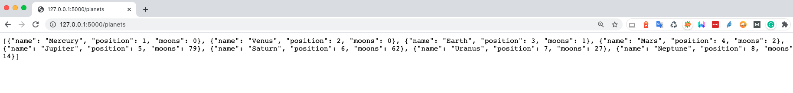
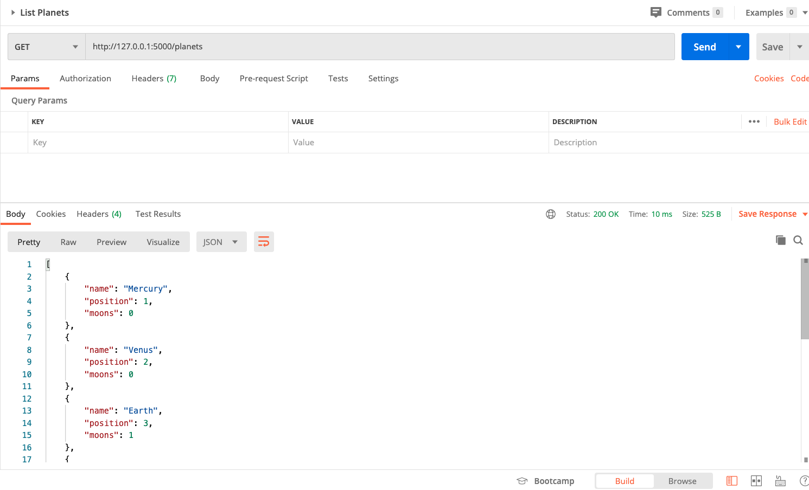

<div align="center">

# Planets And Webhooks

</div>

## Table of Contents

- [About the Project](#📄-about)
- [Getting Started](#🚀-getting-started)
- [Contributing](#🤝-contributing)
- [License](#📝-license)
- [Credits](#🙏-credits)

## 📄 About

Sample [Flask](https://flask.palletsprojects.com/en/1.1.x/ "Flask website") App for 2-way APIs.

It serves up data about planets from [NASA data](https://solarsystem.nasa.gov/moons/in-depth/ "Link to NASA") at `/planets` and `/planets/<position>`.
It also logs the incoming data it receives to a `/webhook` endpoint.

Forked and based on [flask-planets-and-webhooks](https://github.com/lornajane/flask-planets-and-webhooks).

## 🚀 Getting Started

### Requirements

- [Python](https://www.python.org/ "Python website")
- [pip](https://pypi.org/project/pip/ "Link to pip")
- [venv](https://docs.python.org/3/library/venv.html "Link to venv docs")
- [HTTPie](https://httpie.org/ "Link to HTTPie")
- [Postman](https://www.postman.com/ "Link to Postman")

We recommend [pyenv](https://github.com/pyenv/pyenv "Link to pyenv on GitHub") to manage multiple Python versions.

## Install

Clone the repository

### SSH

```shell
git clone git@github.com:ocular-d/flask-planets.git
```

### HTTPS

```shell
https://github.com/ocular-d/flask-planets.git
```


Change into the cloned repository

```shell
cd flask-planets
```

Switch to Python 3.8.2

```shell
pyenv local 3.8.2
```

The repository includes a Makefile for effortless installation.

```make
make venv
```

This will create a [virtual environment](https://docs.python.org/3/tutorial/venv.html#creating-virtual-environments "Link to venv docs")
and install all needed Python packages into this environment.

After the setup is finished is it time to activate the virtual environment.

```shell
source venv/bin/activate
```

Start the application:

```shell
make run
```

If everything goes well you should see output like this:

```shell
 * Serving Flask app "app.py"
 * Environment: production
   WARNING: This is a development server. Do not use it in a production deployment.
   Use a production WSGI server instead.
 * Debug mode: off
INFO:werkzeug: * Running on http://127.0.0.1:5000/ (Press CTRL+C to quit)
```

Open your browser and go to http://127.0.0.1:5000/planets



Check the output with [HttPie](https://httpie.org/ "Link to HTTPie")

```shell
http http://127.0.0.1:5000/planets
HTTP/1.0 200 OK
Content-Length: 379
Content-Type: application/json
Date: Fri, 24 Jul 2020 07:48:34 GMT
Server: Werkzeug/1.0.1 Python/3.8.2

[
    {
        "moons": 0,
        "name": "Mercury",
        "position": 1
    },
    {
        "moons": 0,
        "name": "Venus",
        "position": 2
    },
    {
        "moons": 1,
        "name": "Earth",
        "position": 3
    },
    {
        "moons": 2,
        "name": "Mars",
        "position": 4
    },
    {
        "moons": 79,
        "name": "Jupiter",
        "position": 5
    },
    {
        "moons": 62,
        "name": "Saturn",
        "position": 6
    },
    {
        "moons": 27,
        "name": "Uranus",
        "position": 7
    },
    {
        "moons": 14,
        "name": "Neptune",
        "position": 8
    }
]
```

Check with [Postman](https://www.postman.com/ "Link to Postman")



## 🤝 Contributing

We are a community effort, and everybody is most welcome to participate!

Be it filing bugs, formulating enhancements, creating pull requests, or any other means of contribution, we encourage contributions from everyone.

## 📝 License

Distributed under the [MIT](https://choosealicense.com/licenses/mit/ "Link to license") license.

## Credits

- [Lorna Jane Mitchell](https://github.com/lornajane "Link to bio on GitHub")
